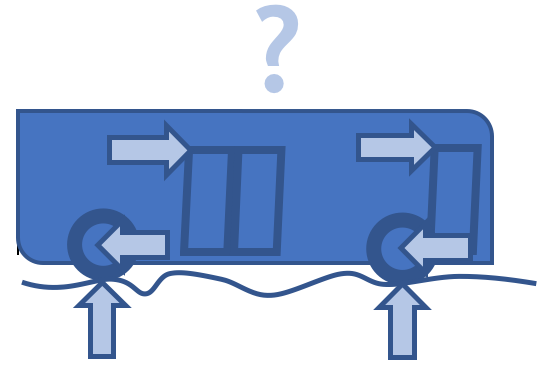
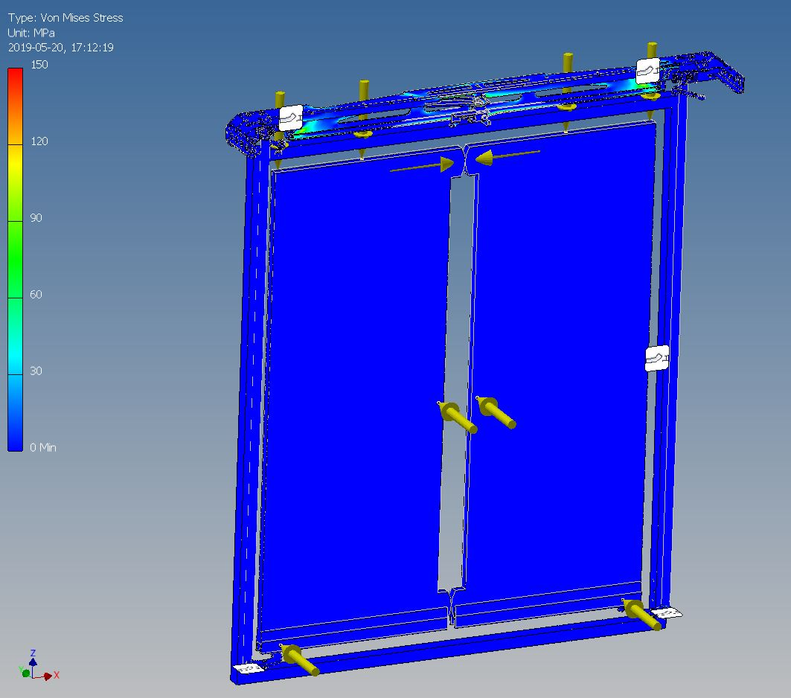

# Mathematical Modeling and Numerical Simulation of Driving Busses and Vibrating Doors

## TUD01 ATHENS Course: 
## Finite Element  Modeling of Vibrating Elastic Structures
## March 11th - 18th, 2023  

## Section 1:/ Introduction

The future sustainable growth of cities and urban areas will increasingly rely on means of mass transport. All major bus manufactures are therefore studying new types of mini-vans, city busses, coaches, double deckers and mono-rail systems. It suffices to browse the webpages of the major bus constructors (e.g. [Volvo](https://www.volvobuses.com/en/), [VDL](https://www.vdlbuscoach.com/en) and [Scania](https://www.scania.com)) to gain an understanding of how this market is transitioning. This development increases  requirements of the door systems. Bus door systems are expected to become lighter, more responsive to passenger via sensors and electronics and more adaptable to a fast changing market.

<div>
 
<center> Figure 1: Bus driving over a bump will causes forces to act on the doors. This project studies how the doors can be made lighter while withstanding the forces on the door.</center>   
</div>

Our industrial partner is worldwide the market leader is the manufacturing of bus doors. It is a successful Dutch high-tech family business that employs hundred people. It maintains contacts with all of the main bus manufactures. It discusses with these partners the predictive maintenance, the condition based monitoring and the data analysis to obtain low maintenance door systems.  

Our industrial partner acquired a solid world-wide reputation over twenty-five years of operation. Doors manufactured by our industrial partner are mounted in busses carrying passenger in almost all European cities, in North America and in Asia. Met by new challenges from the market, the company is eager explore new design and manufacturing (3D printing) options. Bus doors should be light to allow large autonomy of electrical batteries and short opening and closing times (and thus short throughput of passengers). Ways to reduce weight include replacing steel by carbon fiber, reducing the thickness of the glass surfaces, replacing glass by lightweight (or plexi) glass, and reducing the mass of the suspension system (e.g. reducing the diameter of the vertical door arms). Design criteria impose the company to increase the glass surfaces of the doors. At the same time, doors should remain sufficiently strong to meet stringent safety regulations.  The company wishes to gain a fundamental understanding of the doors that is produces. It hopes to employ this understanding to adapt in a fast changing market. It strongly encourages a mathematical modeling and numerical simulation to gain the fundamental insights required. It will provide measurements recorded accelerations acquired on test tracks of various road conditions. Examples of such data can be found in the 2021 student report.  

## Section 2:/ Problem Description 

### Plug Sliding Door Systems 

In this assignment, we will target the plug sliding door systems. These systems are explained on [wiki on plug sliding doors](https://en.wikipedia.org/wiki/Bus_doors#Sliding_plug_doors), is shown in action in [this video](https://www.youtube.com/watch?v=mlLqosaFMSA) and is shown in Figure 2. This system is the door type that Ventura sells most. This system are well known for their use on passenger trains. It consists of two outward revolving door leaves. Some details are provided on the Ventura website [here](https://www.venturasystems.com/plug-sliding-door/). (Need to ask Ventura for mass of the door leafs seperated in steel frame and glass surface). 

<div>

<center> Figure 2: Plug sliding door system with left and right door leaf. The dotted line represents the position of the doors when the doors are open. The top left error represents a static load case in which a force acts on top of a door leaf. The company is interested in reducing the mass of the door while maintaining strength (rigidity) of the door. Lighter systems are easier to transport. It also wishes to increase the glass surface for esthetic purposes.    
</center>   
</div>

### Suspension of Door System to the Bus Frame

The door system is attached to the bus portal (door opening) via a door suspension-and-drive system. This system consists of 

1. two (left and right) vertical door shafts, one each located at each side of the bus portal. These are encircled in green in the left most figure of Figure 2; 
2. a horizontal door shaft mounted at the top of the bus portal. This is encircled in blue in the left most figure of Figure 2; 
3. a top middle attachment point of the door leaf to the top horizontal bar. This is encircled in red in the left most figure of Figure 2. This connection is referred to as the door arm. The doorarm carries the main weight of the door. It can be forced to glide across the top horizontal bar by an electro-mechanically steering system. This gliding causes the doors to be opened or closed. The dimension and shape of the door arm depend on the bus;  
4. a bottom left/right attachment point of the door leaf to the vertical bar. This is encircled in red in the left most figure of Figure 2. These attachment points provide support for the sliding motion of the bus doors. 

More information on the door suspension system can be found in the [description-PS2-door-system](https://mega.nz/file/XU8lFb4T#empMW7_wm3SGOHWvuHrcAE1iY-BhSSgMZ9Ya6Vo87S0). 

<div>

<center> Figure 3: The door suspension system that attaches the door leafs to the bus frame. The figure shows the left and right door arms (encircled in green), top door arm (encircled in blue), the door arm (encircled in red on top) and the bottom door support (encircled in red at the bottom). The suspension is such that the door move (vibrate) outward, away from the centerline seperation the door leafs and in an bottom outward bending fashion. 
    </center>     
</div>

### Research Questions 
In this project, we wish to study how the door system responds to external excitations. These excitations can the exerted directly on the door systems or indirectly via the bus frame. We will consider both static and transient load cases that we describe in more details below. 

### Static Load Cases 
Examples of static load cases include: 
1. bus is in standstill, door is closed: object falls on door: what are maximal displacements and stresses in the door systems: where do maximal stresses occur? Model by describing the frequency response of the door as a single and multiple degrees of freedom system. In the former case, amplitude (see measured data), shape and duration of the impact needs to the described. In the latter case, an eigenmode analysis is required.  
2. bus is in standstill, door is open: mass hanging on door as shown in Figure 2. Same questions a before; 

### Transient Load Cases 

1. vibrations of driving bus transmitted to door for various road conditions (smooth and bumpy road); 
2. extend from deterministic to random vibrations; 

### Possible Divide-and-Conquer Strategy 

Strategy in three steps: 
1. assume door to rigid and door suspension system to act as a set of springs and dampers. Then all of the external force (either static or transient) applied of the door will result in a rigid motion of the door; 
2. assume door to flexible and that door in clamped to the frame of the bus. Then all of the external force applied to the door will result in a deformation of the door; 
3. combination of both of above; 

<div>

<center> Figure 4: Sample result of a finite element simulation of von Misses stress in door and suspension system. More results are shown in the references.  
    </center>
</div>

### An Alternative Door Design 

To stimulate the discussion, we show below an alternative door design. 

<div>

<center> Figure 5: An alternative door design with cross bar.  
    </center>
</div>

#### Julia Programming Language 

We intend to use the programming language [Julia](julialang.org) as coding environment. The motivation for adopting Julia will hopefully become clear as the course evolves.  

- Elementary introduction: [Thinking Julia](https://benlauwens.github.io/ThinkJulia.jl/latest/book.html);
- Aalto Short Course: [julia-introduction](https://github.com/AaltoRSE/julia-introduction); 
- Video Collection by Chris Rackauckas: [link](https://www.youtube.com/playlist?list=PLCAl7tjCwWyGjdzOOnlbGnVNZk0kB8VSa) 
- Pointer to lots of goodies: [Nouvelles Julia](https://pnavaro.github.io/NouvellesJulia/pages/2022_03.html); 

## Section 3:/ Arrangements for the week 

### Schedule for the week 

### Lecture rooms 

1. Monday, March 13th: [Applied Sciences Studio Classsroom 3](https://esviewer.tudelft.nl/space/102/)
2. Tuesday, March 14th: [Civil Engineering and Geosciences Project Room 1.33](https://esviewer.tudelft.nl/space/110/)
3. Wednesday, March 15th: [Applied Sciences Studio Classsroom 3](https://esviewer.tudelft.nl/space/102/) 14:00 - 16:00 : Intro to Comsol Multiphysics  
4. Thursday, March 16th: [Applied Sciences Studio Classsroom 3](https://esviewer.tudelft.nl/space/102/)
5. Friday, March 17th: [Applied Sciences Studio Classsroom 2](https://esviewer.tudelft.nl/space/101/)

### Course Assessment 

1. no formal exam; 
2. attendance is compulsory;  
3. assessment based on active participation in the course; 

## Section 4:/ Overall Approach 

We plan to develop the assignment in various directions as outlined below. 

1. Find recent (max 15 years old) literature that is relevant to this project. Explain what you like about the paper and why it is relevant to this project. Examples are given below. The list can be extended with literature on modeling of impact on plates, multi-material plates, (non-) linear elastic deformations, random vibrations and treatment of measured data; 

a. [Weight optimization and structural analysis of an electric bus chassis frame](https://www.sciencedirect.com/science/article/pii/S2214785320355140?casa_token=HlzlJ0993vUAAAAA:q5hjucXOSQ-QCBk4f7RWKF72Od2-pR9jh7EkY3XdojPWX0jjcEOU_4RWW7IKLDFIqy_NRx7vxWs): mode shape, steel vs. alumunium; 

b. [Dynamic Analysis of Bus Body Frame](https://www.tandfonline.com/doi/pdf/10.1080/00423110500273400?needAccess=true): full bus frame, schematic representation bump; 

c. [Mode Shape Analysis for Bus Chassis](https://iopscience.iop.org/article/10.1088/1757-899X/694/1/012002/pdf): FEM meshing, mode shapes, academic context of the project; 

d. [Design and development of thermoplastic composite roof door for mass transit bus](https://www.sciencedirect.com/science/article/pii/S0261306908003324?casa_token=O9vHpXb0XKkAAAAA:i3a3rLyoY-6A4gtwstyuuLtjRUDSxE0DlGnP3trKxMAijAQI3YbgjUe3jF6pSUY-edOYfdROGRU): bus door, material properties, both modeling and experiments; 

e. [Design strategies for mitigating passenger door holding behavior on suburban trains in Paris](https://www.worldtransitresearch.info/cgi/viewcontent.cgi?article=5055&context=research): combination of human aspect and technology; 

2. build and solve analytical and semi-analytical models;  
3. build and solve finite element models; 
4. analysis of recorded measured acceleration;
These models will be explained in more details in the following. 

## Section 5:/ Material Coefficients 
List here in Lame parameters and Poisson ratio for construction steel, various types of glass and rubber sealing.  

## Section 6:/ Point Mass Systems
See [notebook](./jupyter-notebooks/point-mass-systems.ipynb). 

Requires extension to non-linear spring and damper models.

## Section 7:/ Rigid Multi Body Models (no Deformations)
See [notebook](./jupyter-notebooks/rigid-body-models.ipynb).

## Section 8:/ Flexible Single Body Models (no Rigid Displacements) 

See [notebook](./jupyter-notebooks/flexible-single-body.ipynb).

## Section 9:/ Flexible Multi Body Models 
## (both Deformation and Rigid Body Displacements) 
See [notebook](./jupyter-notebooks/flexible-multi-body.ipynb).

## Section 10:/ Analysis of Data of Measured Acceleration
See [notebook](./jupyter-notebooks/data-analysis.ipynb).

## Ask the Company  
1. condition of the road during test;
2. length of the time sample; 
3. intuitive explanation for difference for measurements in the two longitudinal directions; 

## References 

### Work by previous students 

1. Report by bachelor students January 2023 [report](https://mega.nz/file/fclAzLyJ#K2occvQ4l0BH0zvq83sZ9cpEgALVLSkKv_PLrZ_23gk) and the corresponding [code](https://github.com/jellejurre/BusDoors);
2. Report ATHENS Student November 2022 [report](https://github.com/natan-ber/FEM-bus-door/)
3. Report Bachelor Project Lisette de Bruin [report](https://mega.nz/file/qZljDZAD#xkkAFuHa3g6_LbowJvlTOZP37fdzgC2iV2VIXSp1TyY); 
4. Report Advanced Modeling 2021 [report](https://mega.nz/file/GAVBkZxQ#7_wjWank4pVZAal1j-LS5z9IyPNL_6KZcYJN3H2z7EY); 
5. Report Advanced Modeling 2020 [report](https://mega.nz/file/yUszGIRS#18XzH3jn6Ph7Y5ZgAGA6F19dMhYg17dmrNHEVqnSc1I); 

### Simulation software

1. [Comsol Multiphysics](www.comsol.com), [random vibration test of a motherboard](https://www.comsol.com/model/random-vibration-test-of-a-motherboard-75781) and [vibration in a washing machine assembly](https://www.comsol.com/model/vibration-in-a-washing-machine-assembly-19957); [response spectral analysis](https://www.comsol.com/multiphysics/response-spectrum-analysis); 
2. [Monolithai](www.monolithai.com), [BEAMNG simulator](https://documentation.beamng.com) object on car in various gravitational fields on this [LinkedInn post](https://www.linkedin.com/posts/richard-ahlfeld-36111958_crashtest-physics-engineering-activity-6954810002096144385-QYSV?utm_source=linkedin_share&utm_medium=member_desktop_web);  
3. [LS-Dyna](https://www.dynamore.de/en), this [LinkedInn post](https://www.linkedin.com/feed/update/urn:li:activity:6956680341457674240/) and [pendulum model](https://www.dynamore.de/en/products/models/pendulum) for impact on glass door; other reference for impact on glass window [here](https://www.sciencedirect.com/science/article/pii/S0734743X06001138?casa_token=qT2sT3s0F4wAAAAA:heuP8twh1fmz4li-VurOD_llAhNBP9seTjQSiOEGjSEhKV29EbNI5YVgZNGxsBQZgqjlz20rhxY); 
4. [SolidWorks](www.solidworks.com/simulate) with example of [vibration analysis](https://www.solidworks.com/media/solidworks-simulation-vibration-analysis); 


```julia

```


```julia

```
